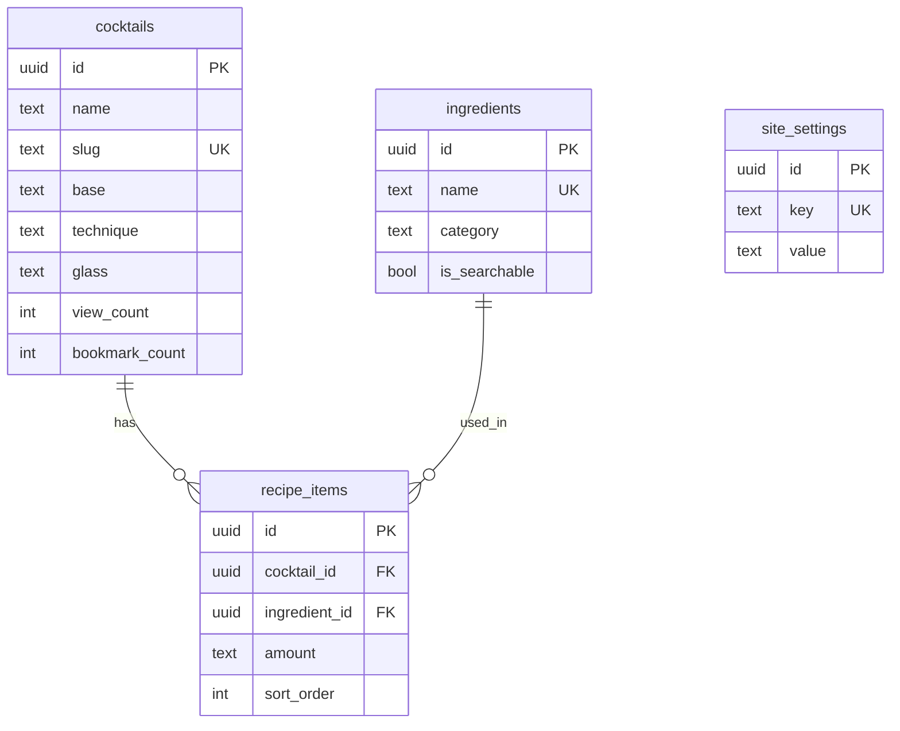

# 基本設計書

## 概要

本ドキュメントは、Cocktailpedia の実装基盤となる設計情報を定義する。
CCはこのドキュメントを参照して実装を行う。

**本ドキュメントの位置づけ**:
- 後から変更するとコストが高い部分を事前に合意するためのもの
- CCの実装方法を縛るためのものではない
- 詳細な画面設計、コンポーネント分割等はCCの判断に委ねる

**要件の曖昧さ・抜け漏れが見つかった場合**:
- 設計書で補うのではなく、要件定義フェーズに差し戻す
- 要件定義書を修正・追記し、施主承認後に設計を再開する
- ただし、技術的詳細の具体化（例：ポーリング間隔、キャッシュ時間等）は設計書に記載してOK

---

## 関連ドキュメント

| ドキュメント | パス | 説明 |
|-------------|------|------|
| 要件定義書 | docs/02_requirements/ | 機能要件、画面要件、非機能要件 |
| 技術選定書 | docs/03_tech_stack/tech_stack.md | 使用技術とその選定理由 |
| コーディング規約 | docs/04_guidelines/coding_standards.md | 実装時のルール |

---

## 1. データモデル設計

### 1.1 テーブル一覧

| テーブル名 | 説明 | 主な用途 |
|-----------|------|---------|
| cocktails | カクテル情報 | カクテルのマスタデータ |
| ingredients | 材料情報 | 材料のマスタデータ |
| recipe_items | レシピ項目 | カクテルと材料の中間テーブル |
| site_settings | サイト設定 | サイト説明文等の設定値 |

### 1.2 テーブル定義

#### cocktails（カクテル）

| カラム名 | 型 | 制約 | 説明 |
|---------|-----|------|------|
| id | uuid | PK | 主キー |
| name | text | NOT NULL | カクテル名（日本語） |
| name_en | text | - | 英語名 |
| name_alias | text | - | 別名 |
| slug | text | UNIQUE, NOT NULL | URLスラッグ |
| description | text | - | 説明・由来・歴史 |
| cocktail_word | text | - | カクテル言葉 |
| base | text | NOT NULL | ベース（基酒）※1 |
| technique | text | NOT NULL | 技法 ※2 |
| glass | text | NOT NULL | グラスの種類 ※3 |
| alcohol_percentage | integer | NOT NULL | 度数（推定、0-100） |
| temperature | text | NOT NULL | 冷たさ ※4 |
| carbonation | text | NOT NULL | 炭酸 ※5 |
| color | text | - | カラー ※6 |
| variation_text | text | - | バリエーション（派生カクテル名、カンマ区切り） |
| image_url | text | - | 画像URL（Supabase Storage） |
| view_count | integer | NOT NULL, DEFAULT 0 | 閲覧回数 |
| bookmark_count | integer | NOT NULL, DEFAULT 0 | ブックマーク数 |
| created_at | timestamp | NOT NULL, DEFAULT now() | 作成日時 |
| updated_at | timestamp | NOT NULL, DEFAULT now() | 更新日時 |

**補足**:
- `slug` はURLに使用（例: `/cocktails/gin-tonic`）
- 画像は Supabase Storage に保存し、URLを格納
- `image_url` が NULL の場合はデフォルト画像（プレースホルダー）を表示
- `variation_text` は「ギブソン, ダーティマティーニ」のようにカンマ区切りで保存

#### ingredients（材料）

| カラム名 | 型 | 制約 | 説明 |
|---------|-----|------|------|
| id | uuid | PK | 主キー |
| name | text | NOT NULL, UNIQUE | 材料名（日本語） |
| name_en | text | - | 英語名 |
| category | text | - | カテゴリ ※7 |
| is_searchable | boolean | NOT NULL, DEFAULT true | 検索条件に表示するか |
| created_at | timestamp | NOT NULL, DEFAULT now() | 作成日時 |
| updated_at | timestamp | NOT NULL, DEFAULT now() | 更新日時 |

#### recipe_items（レシピ項目）

| カラム名 | 型 | 制約 | 説明 |
|---------|-----|------|------|
| id | uuid | PK | 主キー |
| cocktail_id | uuid | FK → cocktails.id ON DELETE CASCADE, NOT NULL | カクテルID |
| ingredient_id | uuid | FK → ingredients.id ON DELETE RESTRICT, NOT NULL | 材料ID |
| amount | text | - | 分量（「30ml」「適量」等） |
| sort_order | integer | NOT NULL, DEFAULT 0 | 表示順 |
| created_at | timestamp | NOT NULL, DEFAULT now() | 作成日時 |

**制約**:
- `cocktail_id + ingredient_id` で複合ユニーク制約（同一カクテルに同一材料の重複登録を防止）

**補足**:
- `amount` はテキスト型。「30ml」「1/2」「適量」など多様な表現に対応
- `sort_order` でレシピ内の材料順序を制御

#### site_settings（サイト設定）

| カラム名 | 型 | 制約 | 説明 |
|---------|-----|------|------|
| id | uuid | PK | 主キー |
| key | text | NOT NULL, UNIQUE | 設定キー |
| value | text | - | 設定値 |
| updated_at | timestamp | NOT NULL, DEFAULT now() | 更新日時 |

**想定する設定キー**:
- `about_content`: サイト説明文（Markdown）

### 1.3 リレーション

```
cocktails 1 --- N recipe_items（1つのカクテルに複数の材料）
ingredients 1 --- N recipe_items（1つの材料が複数のカクテルに使われる）
```



### 1.4 設計方針・補足

| 項目 | 方針 |
|------|------|
| 削除方式 | **物理削除**（論理削除は過剰、データ量も少ない） |
| カスケード削除 | カクテル削除時に recipe_items も自動削除（ON DELETE CASCADE）<br>材料削除時は使用中なら禁止（ON DELETE RESTRICT） |
| ID生成 | **UUID**（Supabase デフォルト） |
| タイムスタンプ | 全テーブル共通で created_at, updated_at を持つ |
| 命名規則 | **snake_case** |
| バリエーション | cocktails.description に記載（別テーブルは作らない） |
| URLスラッグ | カクテル詳細は `slug` を使用（例: `/cocktails/gin-tonic`）。画面要件の `/cocktails/{id}` は `/cocktails/{slug}` として解釈 |

### 1.5 選択肢定義

要件定義で「Ph5設計で定義」とされていた選択肢を以下に定義する。

#### ※1 ベース（base）

| 値 | 表示名 |
|----|--------|
| gin | ジン |
| vodka | ウォッカ |
| rum | ラム |
| tequila | テキーラ |
| whiskey | ウイスキー |
| brandy | ブランデー |
| liqueur | リキュール |
| wine | ワイン |
| beer | ビール |
| non_alcoholic | ノンアルコール |
| other | その他 |

#### ※2 技法（technique）

| 値 | 表示名 |
|----|--------|
| shake | シェイク |
| stir | ステア |
| build | ビルド |
| blend | ブレンド |

#### ※3 グラスの種類（glass）

| 値 | 表示名 |
|----|--------|
| cocktail | カクテルグラス |
| rocks | ロックグラス |
| highball | ハイボールグラス |
| collins | コリンズグラス |
| champagne_flute | シャンパンフルート |
| champagne_saucer | シャンパンソーサー |
| wine | ワイングラス |
| shot | ショットグラス |
| copper_mug | 銅マグ |
| goblet | ゴブレット |
| other | その他 |

#### ※4 冷たさ（temperature）

| 値 | 表示名 |
|----|--------|
| ice | アイス |
| hot | ホット |
| crushed_ice | クラッシュアイス |
| frozen | フローズン |

#### ※5 炭酸（carbonation）

| 値 | 表示名 |
|----|--------|
| strong | 強 |
| weak | 弱 |
| none | 無 |

#### 度数区分（検索用）

検索条件「度数」で使用する範囲区分。テーブルには保存せず、クエリ時に `alcohol_percentage` から計算する。

| 区分 | 表示名 | 範囲 |
|------|--------|------|
| none | 無 | 0% |
| low | 弱 | 1-10% |
| medium | 中 | 11-20% |
| high | 高 | 21%以上 |

#### ※6 カラー（color）

| 値 | 表示名 |
|----|--------|
| red | 赤 |
| orange | オレンジ |
| yellow | 黄 |
| green | 緑 |
| blue | 青 |
| purple | 紫 |
| pink | ピンク |
| brown | 茶 |
| amber | 琥珀 |
| white | 白 |
| clear | 透明 |
| layered | レイヤー（多層） |

#### ※7 材料カテゴリ（category）

| 値 | 表示名 |
|----|--------|
| spirits | スピリッツ |
| liqueur | リキュール |
| wine | ワイン・シャンパン |
| juice | ジュース |
| soda | ソーダ・炭酸 |
| syrup | シロップ |
| dairy | 乳製品 |
| fruit | フルーツ |
| herb | ハーブ・スパイス |
| other | その他 |

### 1.6 関連カクテル計算ロジック

F-012「関連カクテル表示」のロジックを以下のように定義する。

**条件**: 以下のいずれかを満たすカクテルを関連として表示

1. **同じベース** かつ **材料が2つ以上共通**
2. **材料が3つ以上共通**（ベースが異なっても可）

**表示件数**: 最大5件
**並び順**: ブックマーク数が多い順

**実装の委任**: 上記は方針であり、実装の詳細（SQLクエリ最適化等）はCCに委ねる。

---

## 2. API設計

### 判断: API設計は最小限

技術選定により **Next.js 15 (App Router) + Supabase** を採用。

- 公開画面: **Server Components** でSupabaseから直接データ取得
- 管理画面: **Server Actions** でCRUD操作
- Route Handlers（API Routes）: 原則不要

ただし、以下の処理には **Server Actions** を使用する：

| 処理 | 方式 | 理由 |
|------|------|------|
| カクテル閲覧カウント | Server Action | クライアントからの呼び出しが必要 |
| ブックマーク数更新 | Server Action | クライアントからの呼び出しが必要 |
| 管理画面CRUD | Server Action | フォーム送信処理 |
| 画像アップロード | Server Action | ファイル処理 |

### 画像アップロード仕様

| 項目 | 仕様 |
|------|------|
| 対応形式 | **JPEG, PNG, WebP** |
| 最大サイズ | **5MB** |
| 保存先 | Supabase Storage（`cocktail-images` バケット） |
| ファイル名 | `{cocktail_id}.{ext}` 形式で上書き保存 |

**補足**:
- アップロード時に自動でWebP変換はしない（Supabaseのデフォルト動作）
- 表示時の最適化はNext.jsの `<Image>` コンポーネントに委ねる

---

## 3. アーキテクチャ方針

### 3.1 全体構成

```
[ブラウザ] → [Next.js 15 (Vercel)]
                    │
                    ├── Server Components（データ取得）
                    ├── Server Actions（データ更新）
                    └── Middleware（Basic認証）
                    │
                    ▼
            [Supabase]
                ├── PostgreSQL（DB）
                └── Storage（画像）
                    │
                    ▼
            [External]
                └── Google Analytics 4
```

### 3.2 データフロー

#### カクテル一覧表示（トップページ）

```
1. ユーザーがページにアクセス
2. Server Component が Supabase から カクテル一覧を取得（60件）
3. カード形式で一覧を表示
4. スクロールで追加読み込み（Client Component が Server Action を呼び出し）
```

#### カクテル詳細表示

```
1. ユーザーがカクテルカードをクリック
2. /cocktails/[slug] にページ遷移
3. Server Component が Supabase からカクテル詳細を取得
4. 詳細情報を表示
5. Client Component が閲覧カウントを Server Action で更新（マウント時に非同期で実行）
6. Client Component が localStorage に閲覧履歴を記録（最大10件、古いものから削除）
```

#### お気に入り登録/解除

```
1. ユーザーがお気に入りボタンをクリック
2. Client Component が localStorage に保存/削除
3. Client Component が Server Action でブックマーク数を +1/-1
   （通信エラー時もローカル保存は成功させる）
```

#### 管理画面（カクテル登録）

```
1. 管理者が /admin/cocktails/new にアクセス
2. Middleware が Basic認証をチェック
3. フォームに入力
4. Server Action で画像を Supabase Storage にアップロード
5. Server Action で cocktails テーブルに INSERT
6. 一覧ページにリダイレクト
```

### 3.3 その他の方針

| 項目 | 方針 |
|------|------|
| 状態管理 | Server Components 中心。クライアント状態は最小限（お気に入り、検索条件のみ） |
| キャッシュ | Next.js のデフォルトに従う。必要に応じて revalidatePath で再検証 |
| エラーハンドリング | error.tsx で共通処理。詳細はCCに委ねる |
| 無限スクロール | 実装詳細はCCに委ねる（intersection observer 等） |

### 3.4 認証設定

管理画面は Next.js Middleware で Basic認証を実装。

| 環境変数 | 用途 |
|---------|------|
| `ADMIN_USER` | 管理者ユーザー名 |
| `ADMIN_PASSWORD` | 管理者パスワード |

**対象パス**: `/admin/*`

---

## 備考

- 作成日: 2026/01/22
- 作成者: AG
- ステータス: 施主承認済み

### 更新履歴

| 日付 | 内容 | 担当 |
|------|------|------|
| 2026/01/22 | 初版作成 | AG |
| 2026/01/22 | CCレビュー指摘対応（複合ユニーク制約、カスケード削除、NOT NULL制約追加等） | AG |
| 2026/01/22 | CC追加指摘対応（variation_textカラム追加、度数区分定義、デフォルト画像、閲覧カウントタイミング） | AG |
